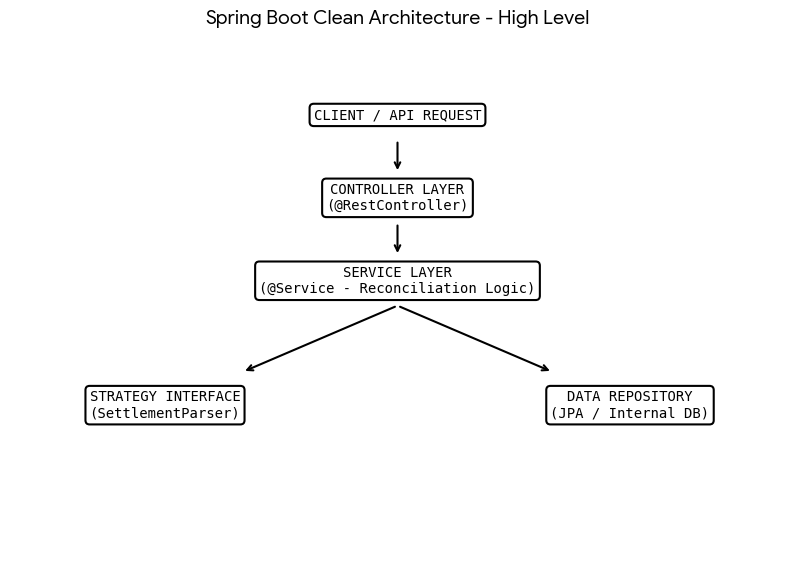
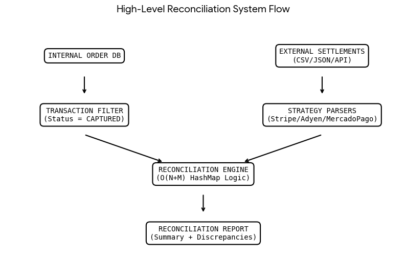

# NovaMart Multi-Processor Settlement Reconciliation Platform

## 1. Target Functionalities
The NovaMart Reconciliation Platform is a mission-critical service designed to automate financial verification. Its core functionalities include:
* **Heterogeneous Ingestion:** Dynamically consumes unstandardized file formats (JSON, CSV) from various payment processors (Stripe, Adyen, etc.).
* **Financial Normalization:** Converts vendor-specific data structures into a unified internal model using `BigDecimal` for precision-critical financial calculations.
* **Discrepancy Identification:**
    * **Missing Settlements:** Detects transactions marked as `CAPTURED` internally but missing in bank reports.
    * **Duplicate Settlements:** Identifies webhook re-deliveries or redundant processor entries.
    * **Amount Mismatches:** Flags variances between internal records and external settlement gross amounts.
    * **Phantom Settlements:** Isolates "rogue" settlements appearing in bank reports without corresponding internal order records.


## 2. Intelligent Reconciliation: Confidence Scoring
To handle complex real-world scenarios where payment processors may assign different transaction references than the internal order ID, the engine implements a **Fuzzy Matching Pass**:

* **Confidence Score 1.0 (High):** An exact match is found on the `transactionId`. This is treated as a definitive state for the reconciliation.
* **Confidence Score 0.7 (Medium):** The `transactionId` is missing, but the engine identifies a record in the settlement report with the **exact same amount**. This flags a potential data entry error or reference mismatch that requires verification by the finance team.
* **Confidence Score 0.0 (Low):** No matching ID or amount found. The transaction is flagged as a critical discrepancy, requiring immediate investigation.


## 3. Architecture and Solution Strategy
We follow **Clean Architecture (Hexagonal Design)** to ensure the system is future-proof and robust.

### The Strategy Pattern (OCP)
The system uses the **Strategy Design Pattern** for file parsing. The `SettlementParser` interface decouples the core reconciliation engine from vendor-specific file formats. Adding a new processor (e.g., MercadoPago) requires creating a new `Parser` implementation, ensuring the core engine remains untouched.

### O(N+M) Data Engine
To handle scale, we avoid $O(N 	imes M)$ nested loops.
* **The Solution:** We ingest the external settlement report into an in-memory `HashMap` keyed by the `transactionId`.
* **The Benefit:** Instead of re-scanning the entire external list for every internal transaction, we perform a constant-time `O(1)` lookup. This results in an $O(N+M)$ total time complexity, allowing the application to process millions of transactions efficiently.

### Data-Intensive Considerations
The current implementation is optimized for performance in memory. For massive, multi-gigabyte datasets, the architecture is designed to transition to **Spring Batch (Chunk-based processing)**, which enables streaming data from disk in small, manageable chunks to prevent `OutOfMemory` errors.

### High Level Design


### System Data Flow



## 4. Execution Guide

### Cloning and Building
1. **Clone the project:**
   ```bash
   git clone <repository-url>
   cd novamart-reconciliation
   ```
2. **Build the application:**
   Ensure you have Maven installed.
   ```bash
   mvn clean install
   ```

### Running the App
1. **Start the server:**
   ```bash
   mvn spring-boot:run
   ```
   The service will start on `http://localhost:8080`.

### Executing Reconciliation
The application provides local endpoints to trigger reconciliation using the test datasets located in `src/main/resources/test-data/`.

* **To run reconciliation for Stripe:**
  ```text
  GET http://localhost:8080/api/v1/reconciliation/run-local-test/STRIPE
  ```
* **To run reconciliation for Adyen:**
  ```text
  GET http://localhost:8080/api/v1/reconciliation/run-local-test/ADYEN
  ```
The system will return a JSON report outlining matches and discrepancies.
